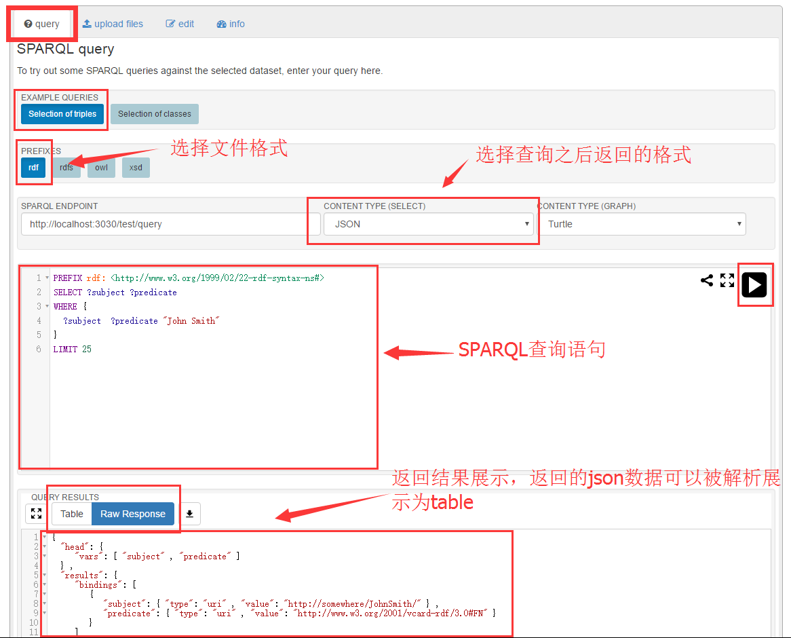
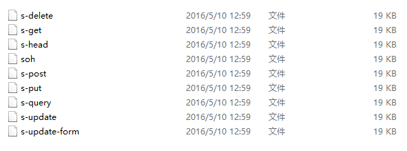
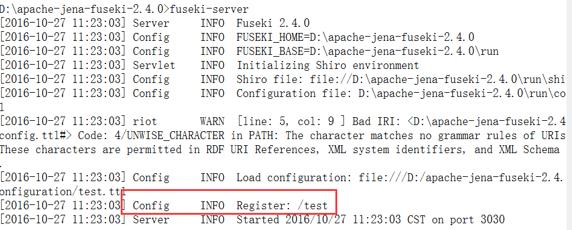
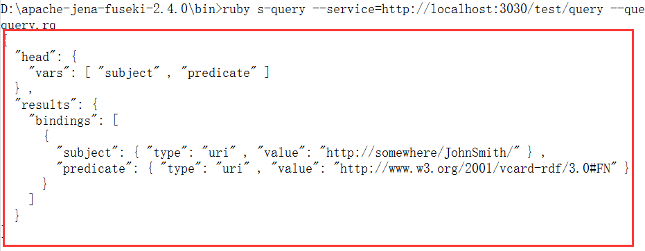
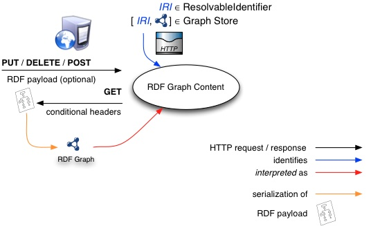
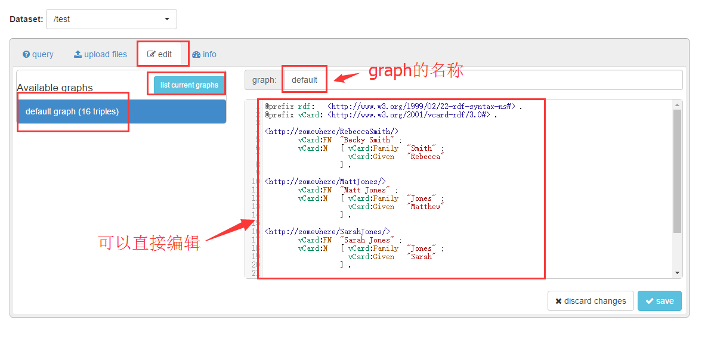
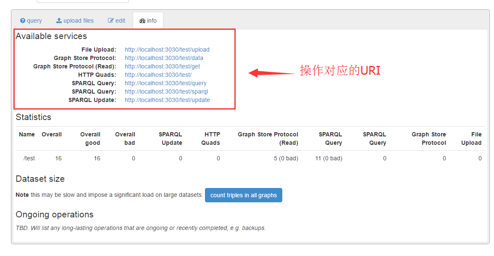
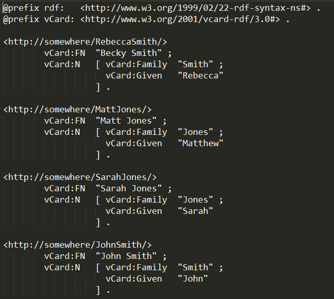

# Fuseki

## 1. 简介

Fuseki是一个HTTP服务器，它主要的作用有

1. 在HTTP的基础上实现了SPARQL通信协议，提供SPARQL的查询远程web服务
2. 内置TDB，可以使用TDB来执行SPARQL查询，获取rdf数据。

## 2. 运行Fuseki

首先要先下载[Fuseki](http://jena.apache.org/download/#apache-jena-fuseki)

然后进行解压，解压之后，文件如下（fuseki v2）


[英文文档地址](http://jena.apache.org/documentation/fuseki2/fuseki-run.html)

### 2.1 命令行运行

在window下，使用命令行运行，只要依赖于两个文件

1. fuseki-server.bat
2. fuseki-server.jar

配置环境的大致步骤为：

1. 将解压后的文件夹路径拷贝，例如d:\\fuseki
2. 配置环境变量，新建一个FUSEKI_HOME = d:\\fuseki
3. 将FUSEKI_HOME添加到PATH的末尾，PATH = ....;%FUSEKI_HOME%
4. 需要在有fuseki-server.jar包的目录下运行（尝试配置了CLASSPATH，但是还是无法运行，会报`Can't find jarfile to run`）

之后，就可以在cmd中，直接运行

```shell
fuseki-server
```

运行之后会在当前目录下创建一个run(FUSEKI_BASE)的文件夹，用于保存运行的实例的各种信息，此外，还可以通过`FUSEKI_BASE/configuration`来配置数据服务。（data service）

在浏览器中输入`localhost:3030`，就可以看到一个配置的页面，


此时，我们需要给其配置一个数据集，才能有进一步的操作，


我们给新建的数据库导入一些数据


根据提示，可以看到可以上传rdf格式的文件作为数据，我们选择了[data/example.rdf](../../resources/data/example.rdf)作为数据上传


上传成功后，我们可以在页面上进行查询



### 2.2 以Web应用程序的形式运行

解压的文件中，还提供了一个war包，这就意味着我们可以直接使用tomcat来运行fuseki。因为Fuseki中要求至少支持Servlet 3.0 API，因此至少要求tomcat版本为7或者Jetty 8，并且java 8。

如果在linux下，FUSEKI_BASE默认为/etc/fuseki，需要为这个文件赋予写的权限。

### 2.3 以服务的形式运行

Fuseki可以作为操作系统的一个服务来运行，并且设置开机启动，在解压的文件中有一个fuseki的搅拌，它其实是一个linux的init.d，可以将fuseki配置到开机启动中。

运行时，进程的参数会从`/etc/default/fuseki`包括`FUSEKI_HOME`和`FUSEKI_BASE`中读取。

## 3. SOH(SPARQL over HTTP)

从解压的文件中，在bin目录下，还提供了



这些其实就是SOH（SPARQL over HTTP）的命令行工具，我们可以通过这些命令行工具来进行SPARQL的查询，通信是基于HTTP协议。

[英文文档SOH](http://jena.apache.org/documentation/fuseki2/soh.html)

由于这些脚本都是采用ruby编写的，因此必须在电脑上先安装ruby，然后配置环境变量，使其能够在cmd中直接运行ruby命令。

来个示例，首先，我们先启动fuseki



可以看到我们在上一节配置的数据集test。

### 3.1 直接查询

```shell
ruby s-query --service=endpointURL 'query string'
ruby s-query --server=endpointURL --query=queryFile.rq
```

在上面搭建的环境下，endpointURL可以在query的页面上查询到，即


我们需要切换到bin目录下，在该目录下，我们新建一个query的脚本文件`testquery.rq`，内容为：

```sql
PREFIX rdf: <http://www.w3.org/1999/02/22-rdf-syntax-ns#>
SELECT ?subject ?predicate
WHERE {
  ?subject  ?predicate "John Smith"
}
LIMIT 25
```

然后执行脚本

```shell
ruby s-query --server=http://localhost:3030/test/query --query=testquery.rq
```

执行结果为（返回的是json数据）



### 3.2 简易的http操作命令

在这里必须介绍一下[SPARQL Graph Store Protocol](https://www.w3.org/TR/sparql11-http-rdf-update/#introduction)这个协议，大致就是通过HTTP头部的操作方法来对RDF的数据模型进行更新操作，示意图如下：



SOH同样提供了脚本，使其能够便捷地对数据模型进行更新，有

* s-get
* s-post
* s-put
* s-delete

脚本语法为（在window环境下同样要加ruby）

```shell
s-VERB databaseURI grapName [file]
```

在fuseki的UI页面对应地有`edit`，可以对模型进行操作



需要注意的是，语法中的`databaseURI`对应的操作有不同的URI，可以在页面中的`info`栏下查看到：



我们直接在命令行对其进行操作(示例)，

```shell
# 获取rdf graph
ruby s-get http://localhost:3030/test/get default > graph
```

打开graph文件，内容与edit页面的编辑框的内容是一致，同为



### 3.3 update操作

我们可以在edit页面上直接编辑操作，也可以使用`s-upadte`来对数据进行更新操作

```shell
s-update --service=endpointURL 'update string'
s-update --service=endpointURL --update=updateFile.ru
```


